<!-- ---------- HEADER ---------- -->
<h1 align="center">
  
</h1>

<h3 align="center">A passionate Java developer from China 🧬 → 💻 </h3>

  <em>Backend & Full-stack •  Spring Boot • AI Agents • RAG • MySQL • Redis • React/VUE • TypeScript
</em>

  

  

<!-- ---------- ABOUT ---------- -->
### About me

- 👩🏻‍💻 I'm Risha, a software engineer focused on **Java backend development and AI-powered systems**.
- 🤖 Currently building **AI agents, RAG pipelines, and multi-agent workflows** with Java.
- 🗄️ Exploring **database internals** by implementing transaction management, MVCC, recovery, caching, and indexing from scratch.
- ⚙️ I enjoy turning system concepts into working projects with **Java, Spring Boot, MySQL, Redis, and PostgreSQL**.
- 🌱 Currently exploring **Solidity and Web3 development** alongside my backend work.
- 📫 Reach me at **janicerx10@gmail.com**.

PS: 💵 现在在做的事情是想要发行自己的meme币, 然后朋友过生日的时候当作礼金🧧送给朋友(不是(ﾉ∀`*)

再PS: 现在的爱好是弹钢琴🎹 和 弹吉他 🎸, 有一把很可爱的墨芬Fender! Aiming to become an amateur piano teacher!  

- 🎹 &  🎸 : Outside of coding, you'll probably find me playing piano or guitar.

---
 
<!-- ---------- TECH STACK BADGES ---------- -->
### Languages & Tools

**Backend**

**Frontend**

**DevOps / Tools**

 

### ☘️ STATS

---

<!-- ---------- STATS ROW ---------- -->
### 🐍 Contribution Graph

  

  <em>
    “一个 Biomedical Engineer 成为 Software Engineer， 
    就像《Chiikawa》里的狮萨 🦁 想成为拉面师傅 🍜 一样天经地义。”
  </em>
    
  <em>
    “A Biomedical Engineer becoming a Software Engineer 
    is just as natural as Shisa 🦁 wanting to become a ramen chef 🍜 in <i>Chiikawa</i>.”
  </em>

### 🎸 LeetCode study 

